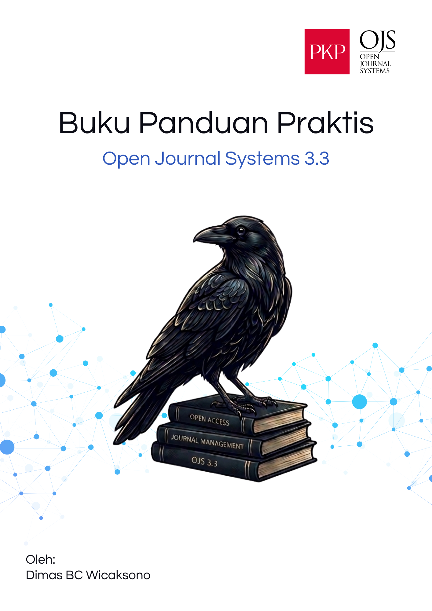

# Panduan Praktis Pengelolaan Jurnal OJS 3.3

  

**Buku Panduan Komprehensif Manajemen Editorial dan Sistem Jurnal Elektronik**

---

## Prakata

Selamat datang di *Panduan Praktis Pengelolaan Jurnal OJS 3.3*. Buku ini disusun tidak hanya sebagai referensi teknis yang kaku, melainkan sebagai kawan pendamping praktis bagi para Editor, Manajer Jurnal, dan pengelola publikasi ilmiah di Indonesia yang sehari-harinya bergelut dengan Open Journal Systems (OJS).

Seiring dengan meningkatnya kebutuhan akan tata kelola jurnal yang transparan, akuntabel, dan terstandarisasi secara global (seperti persyaratan DOAJ dan akreditasi SINTA), peran pengelola jurnal tidak lagi sekadar administratif. Editor modern dituntut untuk menguasai alur kerja digital, memahami metadata, hingga melakukan diseminasi aktif. 

Buku ini disusun secara sistematis menjadi lima bagian utama:
1. **Bagian I:** Pengenalan ekosistem dan persiapan dasar konfigurasi jurnal.
2. **Bagian II:** Alur kerja dari kacamata penulis (*Author*).
3. **Bagian III:** Inti dari tata kelola editorial (dari penerimaan, penugasan, *review*, hingga keputusan).
4. **Bagian IV:** Eksekusi pasca-*review*, meliputi perbaikan bahasa (*copyediting*), tata letak, dan penerbitan edisi.
5. **Bagian V:** Strategi memastikan artikel yang telah terbit dapat ditemukan (*discoverable*) oleh mesin pencari global dan manusia.

Gunakan buku ini tidak sekadar untuk dibaca dari halaman pertama hingga akhir, namun sebagai referensi darurat ketika Anda menghadapi tantangan di lapangan.

---

## Daftar Isi Terpadu

Buku ini terbagi ke dalam bab-bab berikut:

- **Aparatus Depan**
  - [Cara Menggunakan Buku Ini](./cara-menggunakan.md)
- **Bagian I: Pengenalan dan Persiapan Jurnal**
  - [Bab 1: Gambaran Umum Alur Kerja Editorial OJS](./bab1-gambaran-umum.md)
  - [Bab 2: Pengaturan Identitas dan Kebijakan Dasar Jurnal](./bab2-identitas-kebijakan.md)
  - [Bab 3: Pengelolaan e-Resources & Manajemen Referensi](./bab3-eresources.md)
  - [Bab 4: Analisis Subjek & Bibliografi](./bab4-bibliografi.md)
- **Bagian II: Alur Kerja Penulis (Author)**
  - [Bab 5: Panduan Lengkap Mengirimkan Artikel](./bab5-submission.md)
- **Bagian III: Alur Kerja Editorial**
  - [Bab 6: Merespons Kiriman Naskah Baru](./bab6-merespons-naskah.md)
  - [Bab 7: Pemeriksaan Plagiasi (Similarity Check)](./bab7-similarity-check.md)
  - [Bab 8: Menugaskan Peninjau (Assigning Reviewer)](./bab8-assigning-reviewer.md)
  - [Bab 9: Panduan untuk Peninjau (Reviewer)](./bab9-panduan-reviewer.md)
  - [Bab 10: Merespons Hasil Ulasan (Editorial Decision)](./bab10-editorial-decision.md)
- **Bagian IV: Pasca-Review, Produksi, dan Penerbitan**
  - [Bab 11: Penyuntingan Naskah (Copyediting)](./bab11-copyediting.md)
  - [Bab 12: Produksi, Tata Letak & Galley](./bab12-produksi.md)
  - [Bab 13: Manajemen Edisi (Issue) & Pasca Penerbitan](./bab13-manajemen-edisi.md)
  - [Bab 14: Optimalisasi Metadata Artikel](./bab14-metadata.md)
  - [Bab 15: Diseminasi dan Peningkatan Visibilitas Jurnal](./bab15-diseminasi.md)
- **Aparatus Belakang**
  - [Glosarium](./glosarium.md)
  - [Daftar Pustaka Terpadu](./daftar-pustaka.md)
  - [Indeks Subjek](./indeks-subjek.md)
  - [Lampiran](./lampiran.md)
  - [Tentang Penulis](./tentang-penulis.md)
